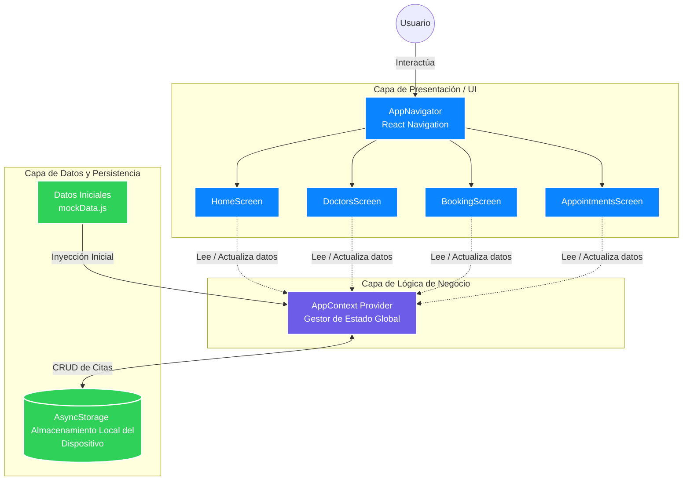

# Documento de Arquitectura de Software
**Proyecto:** Sistema de Reservas de Citas Médicas para Clínica Privada

---

## 1. Descripción del Sistema y Alcance

**Descripción:**
El sistema es una aplicación móvil interactiva diseñada para los pacientes de una clínica privada. Su propósito es digitalizar y simplificar el proceso de agendamiento de consultas médicas, ofreciendo una experiencia de usuario (UX) de alta gama con un diseño premium y animaciones fluidas.

**Alcance:**
El sistema actual contempla la perspectiva del paciente e incluye los siguientes módulos:
*   **Gestión de Perfil:** Visualización de datos médicos básicos y configuración de preferencias.
*   **Catálogo Médico:** Búsqueda y filtrado de especialistas con perfiles detallados.
*   **Motor de Reservas:** Selección de fechas, franjas horarias y tipo de consulta (presencial o telemedicina).
*   **Historial de Citas:** Gestión de citas próximas, pasadas y canceladas.

*Fuera del alcance actual (fase 1):* Panel de administración para doctores, módulo de facturación/pagos integrado y videollamadas nativas para telemedicina.

---

## 2. Requerimientos Arquitectónicos y Atributos de Calidad

Para asegurar el éxito del sistema, la arquitectura debe satisfacer los siguientes atributos de calidad:

1.  **Mantenibilidad:** El código debe ser altamente modular, separando estrictamente la interfaz de usuario (UI), el enrutamiento y la lógica de estado. Esto permite integrar a nuevos desarrolladores rápidamente y agregar features futuras sin refactorizaciones masivas.
2.  **Usabilidad y Rendimiento (Performance):** La aplicación debe renderizar a 60 FPS (cuadros por segundo) para garantizar que las micro-animaciones, gradientes y el "glassmorphism" se sientan fluidos. El paso entre pantallas debe ser sin interrupciones.
3.  **Disponibilidad y Tolerancia a Fallos:** La aplicación no debe cerrarse inesperadamente (crash) si fallan los datos. Debe poder mostrar estados vacíos (empty states) atractivos e informativos.
4.  **Escalabilidad (Evolución):** Aunque actualmente maneja datos locales simulados, la capa de datos debe estar desacoplada para facilitar la futura conexión a una API REST estandarizada o GraphQL.

---

## 3. Comparación y Justificación de Estilos Arquitectónicos

Durante el diseño, se evaluaron dos enfoques arquitectónicos principales para el frontend móvil:

### Enfoque A: Arquitectura en Capas Tradicional (MVC adaptado a UI)
*   **Descripción:** Separación estricta en carpetas de Modelos, Vistas y Controladores. Los datos fluyen jerárquicamente desde el componente superior hasta los hijos ("Prop Drilling").
*   **Ventajas:** Fácil de entender conceptualmente.
*   **Desventajas:** En aplicaciones móviles reactivas, pasar datos a través de 5 niveles de componentes hace que el código sea frágil. Si un componente intermedio cambia, se rompe la cadena.

### Enfoque B: Arquitectura Basada en Componentes con Estado Global (Flux / Context)
*   **Descripción:** Los componentes visuales (UI) se suscriben a un "Almacén Global de Estado". Cuando ocurre un evento (ej. "Cita Reservada"), el estado global se actualiza y notifica *solo* a los componentes que necesitan esos datos.
*   **Ventajas:** Desacoplamiento total. La pantalla de "Mis Citas" y el contador de "Inicio" se actualizan simultáneamente y en tiempo real sin comunicarse directamente entre sí.

### Justificación de la Decisión
Se ha optado por el **Enfoque B (Estado Global mediante React Context API + Componentes Reutilizables)**. Esta arquitectura maximiza la **Mantenibilidad** y el **Rendimiento**. Permite que la capa de UI se concentre exclusivamente en el diseño premium y animaciones, delegando toda la complejidad de negocio (reservar, cancelar, reprogramar) al `AppContext`.

---

## 4. Diagrama General de Arquitectura

El siguiente diagrama muestra los componentes principales, los conectores y el flujo de la información en el sistema construido.

**Descripción del Flujo de Datos:**
1. El usuario interactúa con la **Capa de Presentación** (ej. presiona "Reservar").
2. La vista envía un evento al **AppContext** (`addAppointment`).
3. La lógica de negocio procesa la reserva y la envía a la **Capa de Datos** (`AsyncStorage`).
4. Al completarse la escritura, el `AppContext` actualiza su estado en memoria.
5. Inmediatamente, la **Capa de Presentación** reacciona de forma autónoma, actualizando las tarjetas en `HomeScreen` y `AppointmentsScreen`.

---

## 5. Análisis de las Decisiones Arquitectónicas

### Decisiones y Ventajas

1.  **Uso de React Context para Estado Global:**
    *   *Ventaja:* Evita el antipatrón de "Prop drilling" (pasar parámetros por múltiples componentes). Facilita mantener los componentes "tontos" (que solo renderizan UI) y concentrar las reglas de negocio en un solo archivo.
    *   *Ventaja:* Alta cohesión. Si cambia la estructura de una cita médica, solo se actualiza el Contexto y no cada pantalla individual.

2.  **Uso de AsyncStorage para Persistencia Local:**
    *   *Ventaja:* Permite probar el prototipo de forma funcional sin necesidad de infraestructura backend ni base de datos costosa (AWS/Firebase) durante esta etapa académica.
    *   *Ventaja:* Acceso a datos extremadamente rápido, lo que contribuye a la fluidez del diseño UI/UX solicitado.

3.  **Sistema de Diseño por Tokens (`colors.js`):**
    *   *Ventaja:* Centraliza colores, tamaños y sombras. Garantiza que la aplicación se vea consistente (diseño premium médico) y facilita enormemente la futura implementación de un modo oscuro.

### Desventajas y Riesgos Asociados (Trade-offs)

1.  **Limitación de Escalabilidad del Estado Global (Context):**
    *   *Desventaja:* A medida que el sistema crezca (ej. integrando chats médicos, historiales complejos), `AppContext` podría volverse un cuello de botella de rendimiento debido a re-renderizados innecesarios.
    *   *Mitigación futura:* Migrar la gestión de estado a herramientas más granulares como *Zustand* o *Redux Toolkit*.

2.  **Volatilidad de la Capa de Datos (AsyncStorage):**
    *   *Desventaja:* Al estar basado en almacenamiento local del dispositivo, si el usuario desinstala la aplicación o cambia de celular, perderá su historial de citas médicas. El sistema actualmente carece de una fuente de verdad remota.
    *   *Mitigación futura:* Reemplazar las llamadas de AsyncStorage por solicitudes HTTP estandarizadas a una API en la nube, usando *React Query* para sincronización offline/online.

3.  **Acoplamiento a las dependencias de Expo:**
    *   *Desventaja:* Depender de librerías como `expo-linear-gradient` o la estructura de Expo SDK limita el acceso rápido a código nativo puro de Android/iOS en caso de requerir integraciones de hardware complejas (ej. biometría muy específica).
    *   *Mitigación futura:* Utilizar Expo Development Builds si se requiere escapar del entorno estándar sin perder la comodidad de la arquitectura actual.
